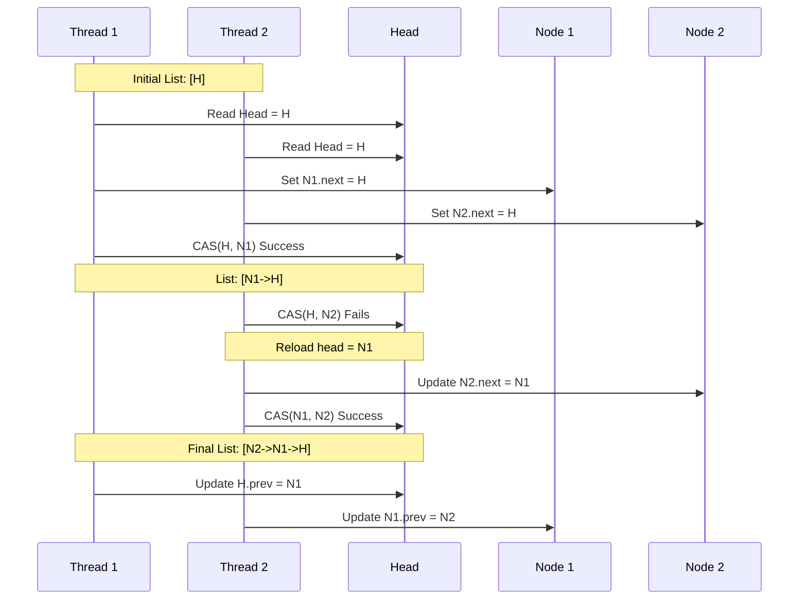
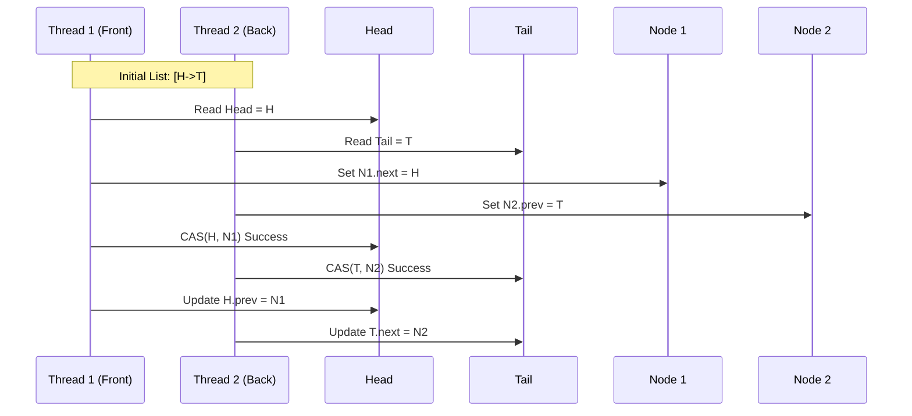
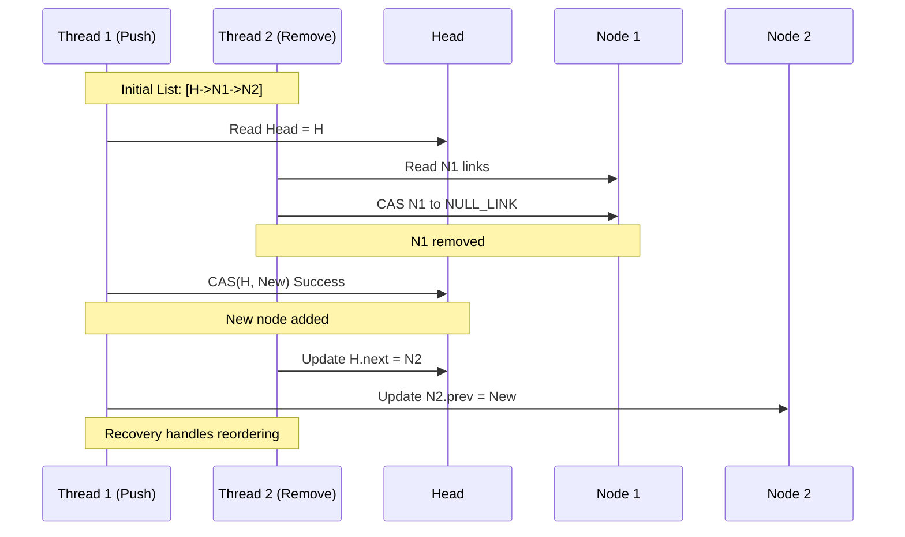
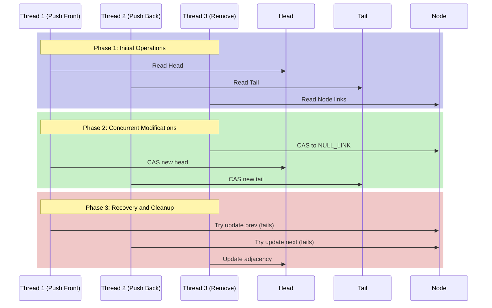

# Concurrent Operations and Correctness Proofs

## 1. Push Operations Correctness Proofs

### 1.1 Push Front Correctness Proof

**Operation Signature:**
```cpp
bool push_front(item_reference item) noexcept;
```

**Preconditions:**
1. `item` is within buffer bounds
2. `item` is not currently in any list
3. `item` node links are initialized to NULL_LINK

**Postconditions:**
1. Item is at the front of the list
2. All existing items maintain their relative order
3. List remains connected

**Formal Proof:**

Let:
- H₀: Initial head state
- H₁: Final head state
- N: New node
- P: Success predicate

```
State transitions:
1. Initial state: [H₀] -> [...rest of list]
2. Prepare new node: N.links = pack_links(H₀, NULL)
3. CAS head: H₁ = CAS(H₀, N)
4. If H₀ exists: Update H₀.prev to N

Proof by cases:

Case 1: Empty List (H₀ = NULL)
    1. CAS(NULL, N) succeeds
    2. No prev pointer update needed
    3. Update tail if NULL
    ∴ List transitions from [] to [N]

Case 2: Non-empty List
    1. CAS(H₀, N) succeeds
    2. H₀.prev updated to N
    ∴ List transitions from [H₀,...] to [N,H₀,...]

Invariants Maintained:
1. ∀n ∈ list: n.next.prev = n
2. ∀n ∈ list: n.prev.next = n
3. head.prev = NULL
4. tail remains valid

Progress Guarantee:
    If CAS fails:
        1. Retry with new head state
        2. Bounded retries ensure termination
        3. At least one thread succeeds
```

### 1.2 Push Back Correctness Proof

**Operation Signature:**
```cpp
bool push_back(item_reference item) noexcept;
```

**Preconditions:**
1. `item` is within buffer bounds
2. `item` is not currently in any list
3. `item` node links are initialized to NULL_LINK

**Formal Proof:**

Let:
- T₀: Initial tail state
- T₁: Final tail state
- N: New node
- P: Success predicate

```
State transitions:
1. Initial state: [...rest of list] -> [T₀]
2. Prepare new node: N.links = pack_links(NULL, T₀)
3. CAS tail: T₁ = CAS(T₀, N)
4. If T₀ exists: Update T₀.next to N

Proof by cases:

Case 1: Empty List (T₀ = NULL)
    1. CAS(NULL, N) succeeds
    2. No next pointer update needed
    3. Update head if NULL
    ∴ List transitions from [] to [N]

Case 2: Non-empty List
    1. CAS(T₀, N) succeeds
    2. T₀.next updated to N
    ∴ List transitions from [...,T₀] to [...,T₀,N]

Invariants Maintained:
1. ∀n ∈ list: n.next.prev = n
2. ∀n ∈ list: n.prev.next = n
3. tail.next = NULL
4. head remains valid

Progress Guarantee:
    If CAS fails:
        1. Retry with new tail state
        2. Bounded retries ensure termination
        3. At least one thread succeeds
```

## 2. Concurrent Operation Examples

### 2.1 Concurrent Push Front Operations



### 2.2 Concurrent Push Front and Push Back



### 2.3 Concurrent Modification Race Resolution



### 2.4 Complex Multi-thread Interleaving



## 3. Correctness Analysis for Concurrent Operations

### 3.1 Interference Freedom

For operations A and B:
```
Let:
- I(A) = Set of nodes modified by A
- I(B) = Set of nodes modified by B

If I(A) ∩ I(B) = ∅:
    Operations are interference-free
Else:
    CAS operations ensure consistent updates
```

### 3.2 Linearization Point Ordering

```
Operation Pairs      | Linearization Point Order
--------------------|-------------------------
push_front/front    | Second CAS sees first's result
push_back/back      | Second CAS sees first's result
push_front/back     | Independent operations
remove/push         | Remove CAS before/after push
```

### 3.3 Progress Guarantees Under Contention

```cpp
For N concurrent operations:
1. At least one operation succeeds in bounded steps
2. Failed operations retry with updated state
3. Maximum retry limit prevents livelock
4. CAS failures indicate state change
```

### 3.4 Recovery Mechanisms

1. **Lost Update Recovery**
```cpp
If operation A fails after partial update:
1. Detect inconsistency through link validation
2. Restore previous state if possible
3. Retry operation with new state
4. Bounded retries prevent infinite loops
```

2. **Concurrent Modification Recovery**
```cpp
When concurrent modifications detected:
1. Validate node state
2. Check adjacent nodes
3. Update links if valid
4. Fail gracefully if invalid
