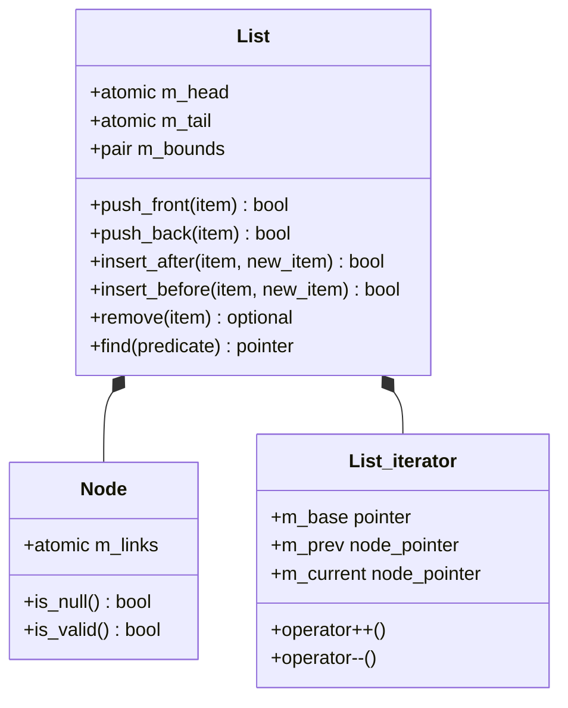
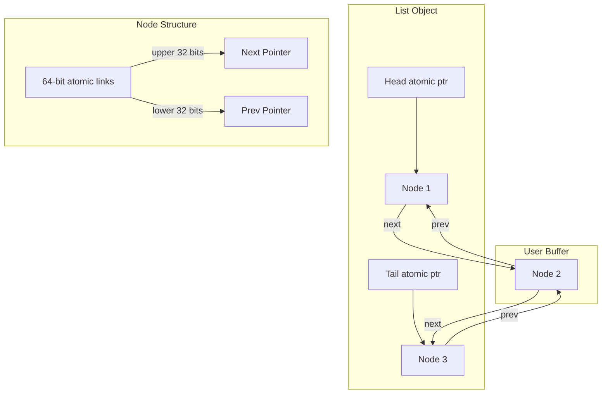
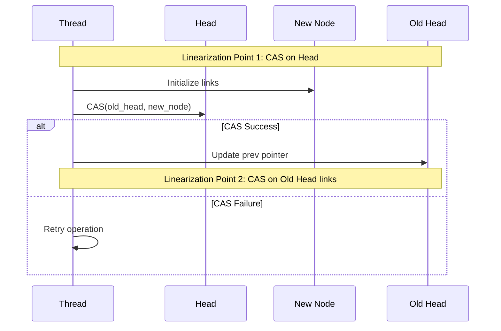
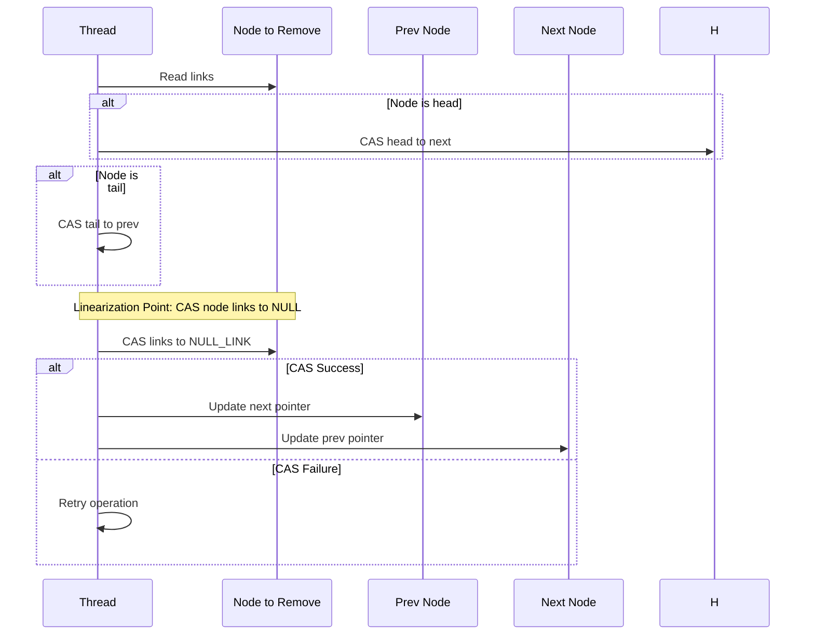
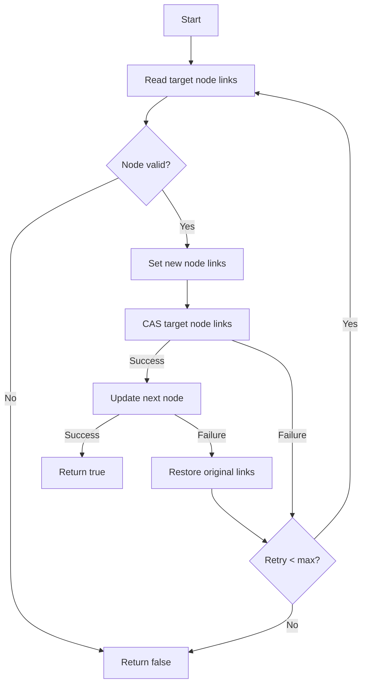
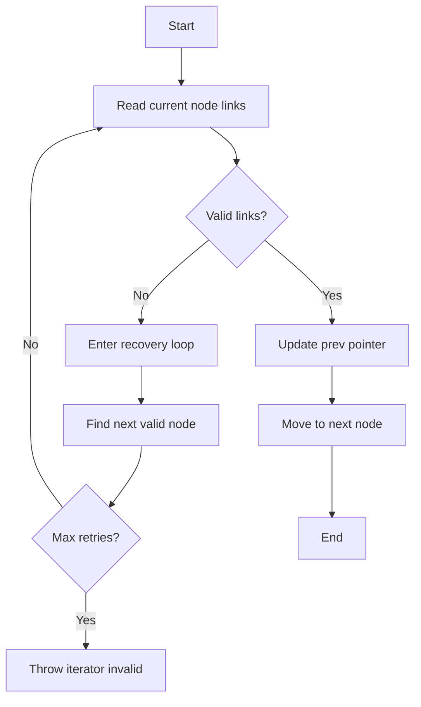
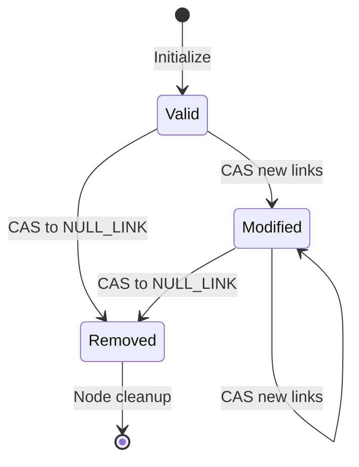
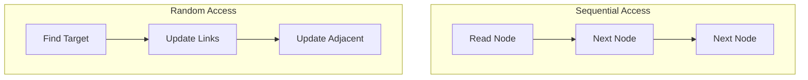

# Lock-free Doubly Linked List Design Document

## 1. Architecture Overview

### 1.1 Core Components



### 1.2 Memory Layout



## 2. Operation Linearization Points

### 2.1 Push Front



**Linearization Points:**
1. Successful CAS on head pointer
2. For non-empty list: Successful CAS on old head's links

### 2.2 Remove Operation



**Linearization Point:** Successful CAS of node links to NULL_LINK

## 3. Control Flow Analysis

### 3.1 Insert After Operation



### 3.2 Iterator Progression



## 4. Critical Path Analysis

### 4.1 Lock-free Property Verification

Each operation maintains the lock-free property by ensuring:
1. No operation holds locks
2. Failed CAS operations don't prevent progress
3. Retry loops have maximum iteration limits
4. System-wide progress is guaranteed

### 4.2 Memory Ordering Requirements

```cpp
// Required memory ordering for each atomic operation
Operation                  | Store         | Load          | CAS
--------------------------|---------------|---------------|----------------
Read node links           | -             | Acquire       | -
Update node links         | Release       | -             | AcqRel
Update head/tail          | Release       | Acquire       | AcqRel
Validate node            | -             | Acquire       | -
```

## 5. ABA Prevention Analysis

### 5.1 Link Structure
```cpp
64-bit atomic word:
[63:32] Next pointer
[31:0]  Prev pointer
```

**ABA Prevention Mechanism:**
1. Combined atomic updates of both pointers
2. Unique link combinations for each state
3. No pointer reuse during node lifetime

### 5.2 State Transitions



## 6. Performance Considerations

### 6.1 Cache Line Optimization

```
Node Layout:
+------------------+
| m_links (8 bytes)|
+------------------+
Aligned to prevent false sharing
```

### 6.2 Critical Paths

High-contention scenarios:
1. Head modifications (push_front)
2. Tail modifications (push_back)
3. Adjacent node removals
4. Iterator recovery paths

### 6.3 Memory Access Patterns



## 7. Consistency Guidelines

### 7.1 Invariants
1. Head has no prev pointer
2. Tail has no next pointer
3. Non-removed nodes form continuous chain
4. All node links are bi-directional

### 7.2 Recovery Mechanisms
1. Iterator recovery from removed nodes
2. Link validation during traversal
3. Atomic state restoration on failure

## 8. Testing Strategy

### 8.1 Test Categories
1. Basic Operations
2. Concurrent Operations
3. Edge Cases
4. Stress Tests
5. Performance Benchmarks

### 8.2 Verification Methods
1. Linearization point analysis
2. Memory ordering verification
3. State transition validation
4. Progress guarantee verification
