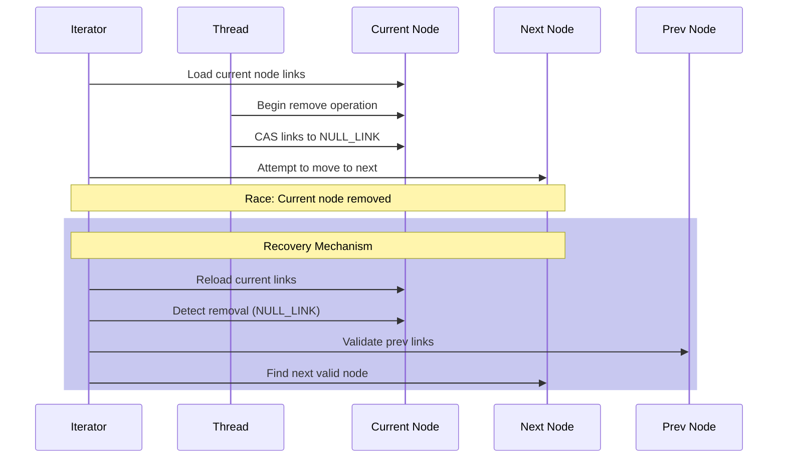
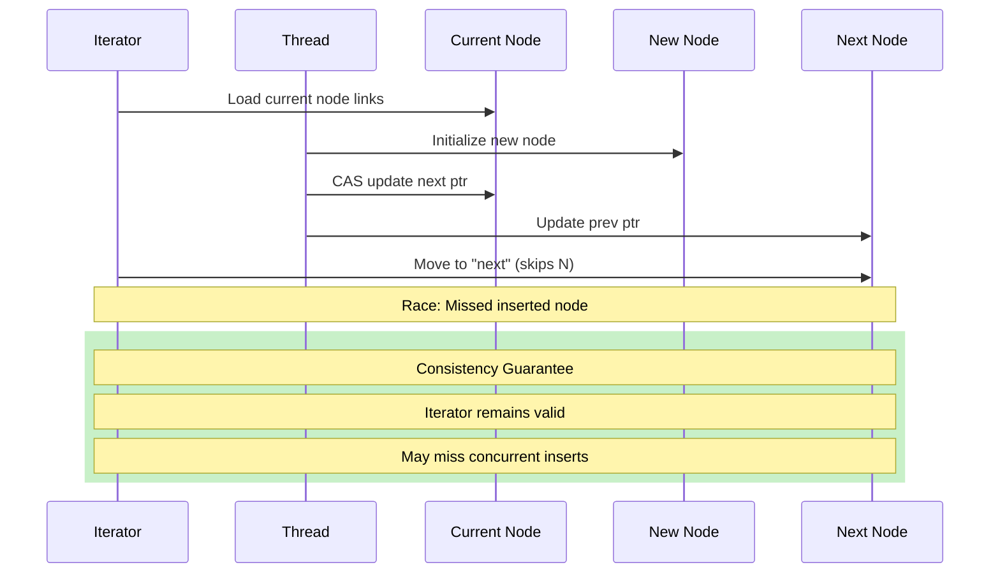
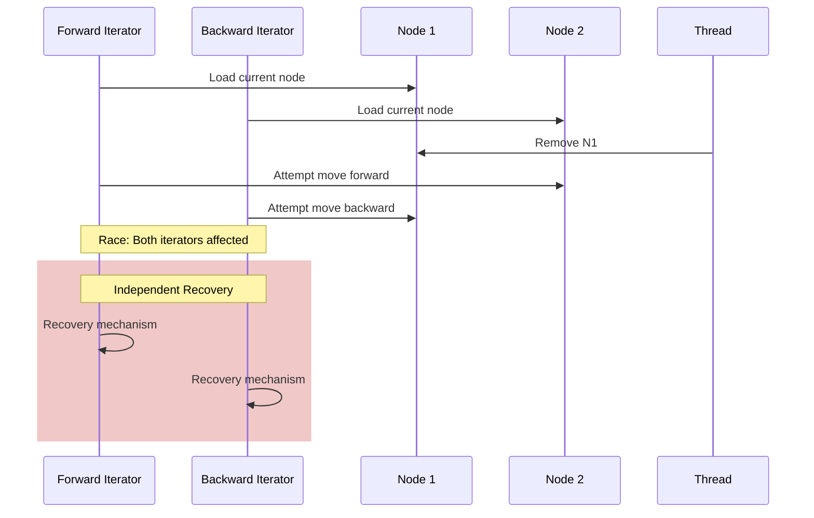

# Iterator Race Condition Analysis

## 1. Iterator Structure and State

```cpp
template<typename T, auto N, bool IsConst = false>
struct List_iterator {
    pointer m_base{};            // Base of buffer
    node_pointer m_prev{};       // Previous node
    node_pointer m_current{};    // Current node
};
```

## 2. Race Condition Categories

### 2.1 Node Removal During Traversal



**Potential Hazards:**
1. Iterator pointing to removed node
2. Lost next/prev references
3. Broken link chain

**Mitigation Strategy:**
```cpp
List_iterator& operator++() noexcept {
    if (!m_current) return *this;
    
    auto current_links = m_current->m_links.load(std::memory_order_acquire);
    node_pointer next{to_node(current_links.first)};

    // Check if current node was removed
    if (to_node(current_links.second) != m_prev) {
        // Recovery loop
        while (m_current != nullptr && 
               to_node(current_links.second) != m_prev) {
            m_current = to_node(current_links.first);
            if (m_current != nullptr) {
                current_links = m_current->m_links.load(std::memory_order_acquire);
                m_prev = to_node(current_links.second);
            }
        }
    }

    m_prev = m_current;
    m_current = next;
    return *this;
}
```

### 2.2 Node Insertion During Traversal



**Race Analysis:**
```cpp
// Possible states during iteration
enum class Iterator_race_state {
    VALID_SEQUENCE,      // Normal traversal
    NODE_REMOVED,        // Current node removed
    NODE_INSERTED,       // Node inserted between current and next
    MULTI_REMOVED,       // Multiple nodes removed
    MULTI_INSERTED       // Multiple nodes inserted
};

// Race condition matrix
Operation       | Iterator Effect          | Recovery Needed
---------------|-------------------------|------------------
Single Remove  | Break chain            | Yes - Find next valid
Multi Remove   | Break chain            | Yes - Find next valid
Single Insert  | Miss node              | No - Still valid
Multi Insert   | Miss nodes             | No - Still valid
Mixed Ops      | Complex state change   | Yes - Validate chain
```

### 2.3 Concurrent Bidirectional Iteration



## 3. Formal Iterator Invariants

```cpp
// Key iterator invariants that must be maintained
template <typename Iterator>
concept Iterator_invariants = requires(Iterator it) {
    // 1. Null state consistency
    { it.m_current == nullptr } -> std::same_as<bool>;
    
    // 2. Link chain validity
    { it.m_current != nullptr } implies
    { it.m_current->links != NULL_LINK };
    
    // 3. Prev pointer consistency
    { it.m_prev != nullptr } implies
    { it.m_prev->links != NULL_LINK };
    
    // 4. Base pointer validity
    { it.m_base != nullptr };
};
```

## 4. Race Mitigation Strategies

### 4.1 Node Validation Protocol

```cpp
// Node state validation during iteration
bool validate_node_state(node_pointer node, node_pointer expected_prev) {
    if (!node) return true;
    
    auto links = node->m_links.load(std::memory_order_acquire);
    if (links == Node::NULL_LINK) return false;
    
    auto [next, prev] = unpack_links(links);
    return to_node(prev) == expected_prev;
}
```

### 4.2 Recovery Protocol

```cpp
// Iterator recovery from invalid state
bool recover_iterator_state() {
    uint32_t retry_count = 0;
    while (retry_count++ < Node::MAX_RETRIES) {
        if (!m_current) return true;
        
        auto links = m_current->m_links.load(std::memory_order_acquire);
        if (links == Node::NULL_LINK) {
            // Move to next and validate
            auto [next, _] = unpack_links(links);
            m_current = to_node(next);
            continue;
        }
        
        if (validate_node_state(m_current, m_prev)) {
            return true;
        }
        
        // Try to recover through link chain
        m_current = find_next_valid_node(m_current);
    }
    throw Iterator_invalidated("Unable to recover iterator state");
}
```

## 5. Iterator Safety Guarantees

### 5.1 Basic Guarantees
```cpp
// Iterator safety levels
enum class Iterator_safety {
    MINIMAL,    // Basic traversal works
    STABLE,     // Survives single modification
    ROBUST      // Survives multiple modifications
};

// Current implementation provides STABLE guarantee:
1. Survives node removal
2. Maintains valid chain
3. May miss concurrent insertions
4. Recovers from invalid states
```

### 5.2 Progress Guarantees

```cpp
// Progress guarantees for iterator operations
template <typename Iterator>
concept Iterator_progress = requires(Iterator it) {
    // 1. Forward progress
    { ++it } -> std::same_as<Iterator&>;
    
    // 2. Backward progress
    { --it } -> std::same_as<Iterator&>;
    
    // 3. Bounded recovery
    { it.recover_state() } -> std::same_as<bool>;
};
```

## 6. Recommendations for Safe Iterator Usage

1. **Short Iteration Spans**
```cpp
// Prefer short iterations to minimize race window
for (auto it = list.begin(); it != list.end(); ++it) {
    // Minimize work in iteration body
}
```

2. **Exception Handling**
```cpp
// Handle potential iterator invalidation
try {
    for (const auto& item : list) {
        process(item);
    }
} catch (const Iterator_invalidated& e) {
    // Handle iterator recovery failure
}
```

3. **Validation Points**
```cpp
// Add explicit validation for critical operations
auto it = list.begin();
while (it != list.end()) {
    if (!it.validate_state()) {
        // Handle invalid state
        break;
    }
    ++it;
}
```
