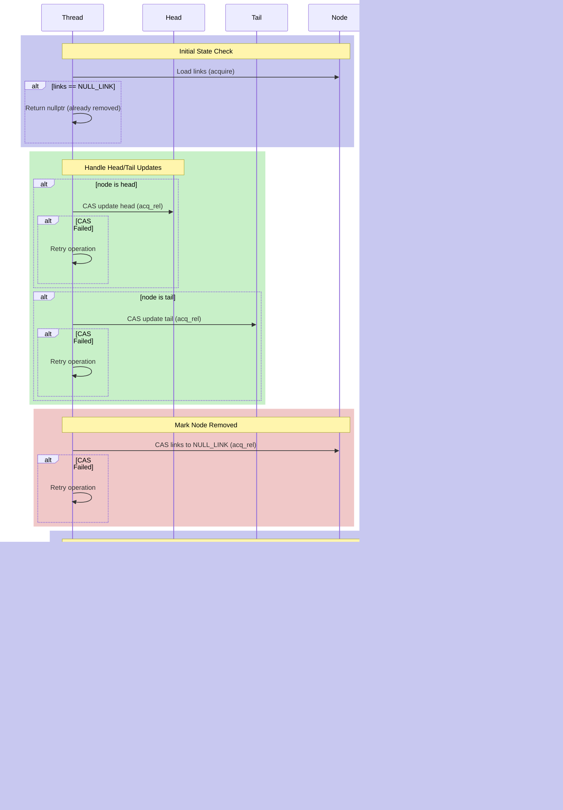

# Detailed Operation Analysis and Correctness Proof

## 1. Detailed Sequence Diagrams

### 1.1 Push Front Operation


### 1.2 Insert After Operation


### 1.3 Remove Operation



## 2. Correctness Analysis

### 2.1 Safety Properties

1. **Node Integrity**
```
Property: A node's links are always in a consistent state
Proof:
1. All link updates use atomic CAS operations
2. Link updates are packed in single 64-bit value
3. Failed CAS operations leave node unchanged
4. Removed nodes are marked with NULL_LINK
```

2. **List Connectivity**
```
Property: The list maintains proper connectivity
Proof:
1. For any non-removed nodes A and B where A->next = B:
   - A's next pointer points to B
   - B's prev pointer points to A
2. Head node has no prev pointer
3. Tail node has no next pointer
4. All modifications maintain these invariants
```

### 2.2 Linearization Points Analysis

```cpp
Operation        | Linearization Point                  | Visibility
-----------------|-------------------------------------|------------
push_front       | Successful CAS on head              | Global
push_back        | Successful CAS on tail              | Global
remove           | Successful CAS to NULL_LINK         | Global
insert_after     | Successful CAS on target next ptr   | Global
insert_before    | Successful CAS on target prev ptr   | Global
find            | Read of node links if not NULL_LINK | Thread-local
```

### 2.3 Progress Guarantees

1. **Lock-Freedom**
```
Property: System-wide progress is guaranteed
Proof:
1. No operation contains locks
2. All loops have bounded retries
3. Failed CAS operations don't block other threads
4. At least one thread makes progress in bounded steps
```

2. **Operation Independence**
```
Property: Operations on different nodes don't interfere
Proof:
1. Only adjacent node modifications can conflict
2. CAS failures lead to retries
3. No operation blocks others indefinitely
4. Recovery mechanisms handle concurrent modifications
```

### 2.4 ABA Prevention Analysis

1. **Link Structure Protection**
```
Property: ABA problems are prevented without generation counters
Proof:
1. 64-bit atomic word contains both pointers
2. Node reuse requires exact link match
3. NULL_LINK state prevents premature reuse
4. Adjacent node updates verify expected state
```

2. **Modification Detection**
```
Property: Concurrent modifications are detected
Proof:
1. CAS operations verify full link state
2. Link updates change both pointers
3. Removed nodes have distinct NULL_LINK state
4. Iterator recovery handles removed nodes
```

### 2.5 Memory Ordering Correctness

```cpp
// Critical Memory Ordering Requirements
Operation               | Required Ordering | Justification
-----------------------|------------------|---------------
Initial node read      | Acquire         | Observe node state
Node link update      | Acq_Rel         | Atomic state change
Head/Tail update      | Acq_Rel         | List structure change
Link initialization   | Relaxed         | Single-thread access
```

### 2.6 Invariant Maintenance

1. **List Structure Invariants**
```
At all times:
1. head->prev == NULL
2. tail->next == NULL
3. ∀ node: node->next->prev == node
4. ∀ node: node->prev->next == node
5. removed nodes: links == NULL_LINK
```

2. **Modification Invariants**
```
For all operations:
1. No modification creates cycles
2. No modification breaks connectivity
3. No modification loses nodes
4. No modification creates dangling pointers
```
